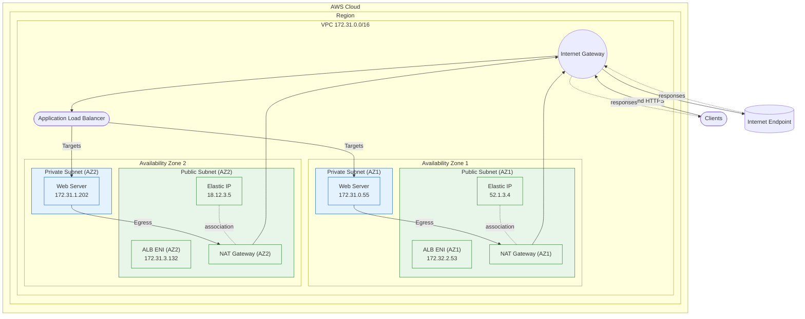
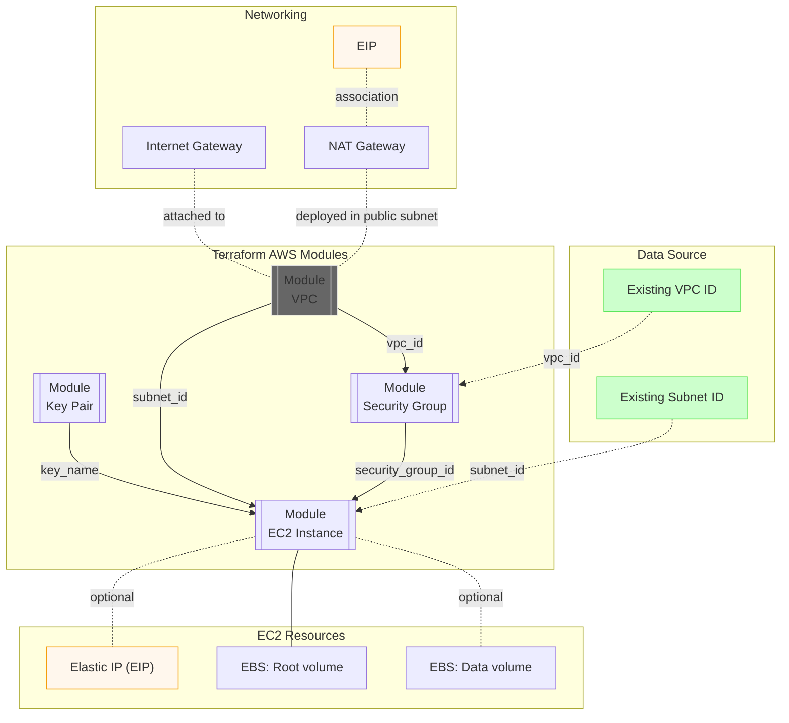

# AWS EC2

The **AWS EC2** module focuses on setting up network infrastructure (VPC) and EC2 instances. The module leverages upstream `Terraform AWS Module` to deliver EC2 instance, VPC, Key Pairs, and Security Groups integration.

- [1. Details](#1-details)
  - [1.1. Modules](#11-modules)
  - [1.2. Architecture Diagrams](#12-architecture-diagrams)
    - [1.2.1. AWS](#121-aws)
    - [1.2.2. Terraform](#122-terraform)
- [2. Usage](#2-usage)
  - [2.1. Module](#21-module)
- [3. Requirements](#3-requirements)
- [4. Providers](#4-providers)
- [5. Modules](#5-modules)
- [6. Resources](#6-resources)
- [7. Inputs](#7-inputs)
- [8. Outputs](#8-outputs)

## 1. Details

### 1.1. Modules

> [!NOTE]
> Module Source using [Terraform Registry](https://registry.terraform.io/)

- `terraform-aws-modules/key-pair`
  > Key pairs are used for securely accessing instances via SSH (Secure Shell) connections. Specify a key pair for the EC2 instance, and the corresponding public key is deployed to the instance. This allows to securely authenticate and access the instance using the associated private key.

- `terraform-aws-modules/vpc`
  > - **VPC**: Defines a Virtual Private Cloud (VPC), a logically isolated network segment within the cloud platform. It provides a private IP address range for the cloud resources, ensuring controlled and secure networking.
  >
  > - **Subnets**: Creates one or more subnets within the VPC. A subnet is a segment of the VPC's IP address range. Public and private subnets are created to separate resources based on access requirements. Public subnets are generally used for resources that need internet access, while private subnets are used for internal resources.
  >
  > - **Internet Gateway (IGW)**: Creates an Internet Gateway and attaches it to the VPC, enabling communication between instances in the VPC and the internet. The IGW serves as the entry and exit point for traffic between the VPC and the internet, allowing public subnets to connect to the internet.
  >
  > - **NAT Gateway and EIP**: Creates a NAT (Network Address Translation) Gateway and an associated Elastic IP (EIP). The NAT Gateway enables instances in private subnets to initiate outbound internet traffic while preventing direct inbound access. The EIP ensures the NAT Gateway has a consistent public IP address.
  >
  > - **Route Tables**: Creates route tables for public and private subnets. Route tables define how traffic is routed within the VPC. Public route tables direct traffic to the internet via the IGW, while private route tables manage traffic within the VPC or through the NAT Gateway for outbound internet access.

  > [!NOTE]
  > Consider AWS Transit Gateway for scaling the VPC architecture to multiple regions or accounts for network isolation and security.

- `terraform-aws-modules/security-group/aws`
  > Security groups act as virtual firewalls to control both inbound (ingress) and outbound (egress) traffic to and from EC2 instances. Inbound rules define what traffic is allowed to enter the instance, and outbound rules specify what traffic is allowed to leave.

- `terraform-aws-modules/ec2-instance/aws`
  > - **EC2 Instance**: Provides an AWS EC2 instance resource, allowing to launch and manage virtual machines in the AWS cloud.
  >
  > - **Elastic Block Store (EBS) Volume**: Creates and attaches Elastic Block Store (EBS) volumes to EC2 instances. EBS volumes provide persistent block storage for instances, allowing data to persist even after the instance is stopped or terminated.
  >
  > - **Elastic IP (EIP) and EIP Association**: Creates a static public IP address for the EC2 instance using an Elastic IP (EIP) and provides an AWS EIP Association resource. This ensures that the EC2 instance has a consistent public IP address, even after being stopped and started.

  > [!NOTE]
  > Consider AWS Systems Manager (SSM) for secure, internal access without requiring a public IP and SSH access with the need for a key pair.

### 1.2. Architecture Diagrams

#### 1.2.1. AWS



#### 1.2.2. Terraform



## 2. Usage

### 2.1. Module

- AWS EC2
  > The `main.tf` in the root calls `modules/aws-ec2`. Variables in `modules/aws-ec2/variables.tf` govern the configuration of network infrastructure, security groups, key pairs, and EC2 instances, providing a modular and customizable foundation for compute resources.

  ```hcl
  provider "aws" {
    region = var.region
  }

  module "aws_ec2" {
    source = "./modules/aws-ec2"

    # AWS configuration
    name       = var.name
    key_path   = var.key_path

    # VPC configuration
    vpc_cidr               = var.vpc_cidr
    vpc_private_subnets    = var.vpc_private_subnets
    vpc_public_subnets     = var.vpc_public_subnets
    vpc_enable_nat_gateway = var.vpc_enable_nat_gateway
    vpc_single_nat_gateway = var.vpc_single_nat_gateway

    # AMI configuration
    ami_most_recent          = var.ami_most_recent
    ami_owners               = var.ami_owners
    ami_image_name           = var.ami_image_name
    ami_image_pattern        = var.ami_image_pattern
    ami_virtualization_name  = var.ami_virtualization_name
    ami_virtualization_types = var.ami_virtualization_types

    # Security group configuration
    security_group_description              = var.security_group_description
    security_group_ingress_cidr_blocks      = var.security_group_ingress_cidr_blocks
    security_group_ingress_ipv6_cidr_blocks = var.security_group_ingress_ipv6_cidr_blocks
    security_group_ingress_rules            = var.security_group_ingress_rules
    security_group_egress_rules             = var.security_group_egress_rules
    security_group_ingress_with_cidr_blocks = var.security_group_ingress_with_cidr_blocks

    # EC2 instance configuration
    ec2_instance_type = var.ec2_instance_type

    # EBS volume configuration
    ebs_root_encrypted   = var.ebs_root_encrypted
    ebs_root_size        = var.ebs_root_size
    ebs_root_type        = var.ebs_root_type
    ebs_root_throughput  = var.ebs_root_throughput

    ebs_data_create      = var.ebs_data_create
    ebs_data_encrypted   = var.ebs_data_encrypted
    ebs_data_size        = var.ebs_data_size
    ebs_data_type        = var.ebs_data_type
    ebs_data_throughput  = var.ebs_data_throughput
    ebs_data_device_name = var.ebs_data_device_name

    # EIP configuration
    eip_create = var.eip_create

    tags = var.tags
  }
  ```

<!-- BEGIN_TF_DOCS -->
## 3. Requirements

| Name                                                                      | Version  |
| ------------------------------------------------------------------------- | -------- |
| <a name="requirement_terraform"></a> [terraform](#requirement\_terraform) | >= 1.7.0 |
| <a name="requirement_aws"></a> [aws](#requirement\_aws)                   | >= 6.0   |
| <a name="requirement_tls"></a> [tls](#requirement\_tls)                   | >= 4.0   |

## 4. Providers

| Name                                              | Version |
| ------------------------------------------------- | ------- |
| <a name="provider_aws"></a> [aws](#provider\_aws) | >= 6.0  |

## 5. Modules

| Name                                                                             | Source                                   | Version |
| -------------------------------------------------------------------------------- | ---------------------------------------- | ------- |
| <a name="module_ec2_instance"></a> [ec2\_instance](#module\_ec2\_instance)       | terraform-aws-modules/ec2-instance/aws   | 6.1.1   |
| <a name="module_key_pair"></a> [key\_pair](#module\_key\_pair)                   | terraform-aws-modules/key-pair/aws       | 2.1.0   |
| <a name="module_security_group"></a> [security\_group](#module\_security\_group) | terraform-aws-modules/security-group/aws | 5.3.0   |
| <a name="module_vpc"></a> [vpc](#module\_vpc)                                    | terraform-aws-modules/vpc/aws            | 6.0.1   |

## 6. Resources

| Name                                                                                                                                  | Type        |
| ------------------------------------------------------------------------------------------------------------------------------------- | ----------- |
| [aws_ami.machine](https://registry.terraform.io/providers/hashicorp/aws/latest/docs/data-sources/ami)                                 | data source |
| [aws_availability_zones.available](https://registry.terraform.io/providers/hashicorp/aws/latest/docs/data-sources/availability_zones) | data source |

## 7. Inputs

| Name                                                                                                                                                              | Description                                                                                                                                                                   | Type                                                                                                                                                                                | Default                                                                                                                                                                                                                                                                                                                                                                                                                                          | Required |
| ----------------------------------------------------------------------------------------------------------------------------------------------------------------- | ----------------------------------------------------------------------------------------------------------------------------------------------------------------------------- | ----------------------------------------------------------------------------------------------------------------------------------------------------------------------------------- | ------------------------------------------------------------------------------------------------------------------------------------------------------------------------------------------------------------------------------------------------------------------------------------------------------------------------------------------------------------------------------------------------------------------------------------------------ | :------: |
| <a name="input_ami_device_name"></a> [ami\_device\_name](#input\_ami\_device\_name)                                                                               | The root device type used by the AMI.                                                                                                                                         | `string`                                                                                                                                                                            | `"root-device-type"`                                                                                                                                                                                                                                                                                                                                                                                                                             |    no    |
| <a name="input_ami_device_types"></a> [ami\_device\_types](#input\_ami\_device\_types)                                                                            | The root device type, typically EBS-backed for encryption support.                                                                                                            | `list(string)`                                                                                                                                                                      | <pre>[<br/>  "ebs"<br/>]</pre>                                                                                                                                                                                                                                                                                                                                                                                                                   |    no    |
| <a name="input_ami_image_name"></a> [ami\_image\_name](#input\_ami\_image\_name)                                                                                  | The name used to select Amazon Machine Images (AMIs).                                                                                                                         | `string`                                                                                                                                                                            | `"name"`                                                                                                                                                                                                                                                                                                                                                                                                                                         |    no    |
| <a name="input_ami_image_patterns"></a> [ami\_image\_patterns](#input\_ami\_image\_patterns)                                                                      | The AMI pattern to search for, e.g., Amazon Linux 2023 (AL2023) IDs.                                                                                                          | `list(string)`                                                                                                                                                                      | <pre>[<br/>  "al2023-ami-2023*-x86_64"<br/>]</pre>                                                                                                                                                                                                                                                                                                                                                                                               |    no    |
| <a name="input_ami_most_recent"></a> [ami\_most\_recent](#input\_ami\_most\_recent)                                                                               | Use the most recent AMI from the list.                                                                                                                                        | `bool`                                                                                                                                                                              | `true`                                                                                                                                                                                                                                                                                                                                                                                                                                           |    no    |
| <a name="input_ami_owners"></a> [ami\_owners](#input\_ami\_owners)                                                                                                | AMI Owners.                                                                                                                                                                   | `list(string)`                                                                                                                                                                      | <pre>[<br/>  "amazon"<br/>]</pre>                                                                                                                                                                                                                                                                                                                                                                                                                |    no    |
| <a name="input_ami_virtualization_name"></a> [ami\_virtualization\_name](#input\_ami\_virtualization\_name)                                                       | The virtualization method used by the AMI.                                                                                                                                    | `string`                                                                                                                                                                            | `"virtualization-type"`                                                                                                                                                                                                                                                                                                                                                                                                                          |    no    |
| <a name="input_ami_virtualization_types"></a> [ami\_virtualization\_types](#input\_ami\_virtualization\_types)                                                    | The virtualization standard, e.g., Hardware Virtual Machine (HVM) used by Amazon EC2 instances.                                                                               | `list(string)`                                                                                                                                                                      | <pre>[<br/>  "hvm"<br/>]</pre>                                                                                                                                                                                                                                                                                                                                                                                                                   |    no    |
| <a name="input_azs_state"></a> [azs\_state](#input\_azs\_state)                                                                                                   | Filter to retrieve availability zones in a specific state.                                                                                                                    | `string`                                                                                                                                                                            | `"available"`                                                                                                                                                                                                                                                                                                                                                                                                                                    |    no    |
| <a name="input_ebs_data_create"></a> [ebs\_data\_create](#input\_ebs\_data\_create)                                                                               | Whether to create and attach an data EBS volume.                                                                                                                              | `bool`                                                                                                                                                                              | `false`                                                                                                                                                                                                                                                                                                                                                                                                                                          |    no    |
| <a name="input_ebs_data_device_name"></a> [ebs\_data\_device\_name](#input\_ebs\_data\_device\_name)                                                              | Logical device name for the data EBS volume attachment, the names `/dev/sd[f-p]` map to NVMe `/dev/nvme*n*` device nodes. NOTE Do not use root names `/dev/sda`, `/dev/sda1`. | `string`                                                                                                                                                                            | `"/dev/sdf"`                                                                                                                                                                                                                                                                                                                                                                                                                                     |    no    |
| <a name="input_ebs_data_encrypted"></a> [ebs\_data\_encrypted](#input\_ebs\_data\_encrypted)                                                                      | Specifies whether the data EBS volume will be encrypted.                                                                                                                      | `bool`                                                                                                                                                                              | `true`                                                                                                                                                                                                                                                                                                                                                                                                                                           |    no    |
| <a name="input_ebs_data_iops"></a> [ebs\_data\_iops](#input\_ebs\_data\_iops)                                                                                     | The data EBS volume IOPS (Input/Output Operations Per Second).                                                                                                                | `number`                                                                                                                                                                            | `3000`                                                                                                                                                                                                                                                                                                                                                                                                                                           |    no    |
| <a name="input_ebs_data_size"></a> [ebs\_data\_size](#input\_ebs\_data\_size)                                                                                     | Size of the data EBS volume in GB.                                                                                                                                            | `number`                                                                                                                                                                            | `50`                                                                                                                                                                                                                                                                                                                                                                                                                                             |    no    |
| <a name="input_ebs_data_snapshot_id"></a> [ebs\_data\_snapshot\_id](#input\_ebs\_data\_snapshot\_id)                                                              | Snapshot ID to use for the data EBS volume.                                                                                                                                   | `string`                                                                                                                                                                            | `null`                                                                                                                                                                                                                                                                                                                                                                                                                                           |    no    |
| <a name="input_ebs_data_throughput"></a> [ebs\_data\_throughput](#input\_ebs\_data\_throughput)                                                                   | The data EBS volume throughput in MiB/s.                                                                                                                                      | `number`                                                                                                                                                                            | `200`                                                                                                                                                                                                                                                                                                                                                                                                                                            |    no    |
| <a name="input_ebs_data_type"></a> [ebs\_data\_type](#input\_ebs\_data\_type)                                                                                     | Type of the data EBS volume.                                                                                                                                                  | `string`                                                                                                                                                                            | `"gp3"`                                                                                                                                                                                                                                                                                                                                                                                                                                          |    no    |
| <a name="input_ebs_enable_volume_tags"></a> [ebs\_enable\_volume\_tags](#input\_ebs\_enable\_volume\_tags)                                                        | Whether to enable volume tags (if enabled it conflicts with `root_block_device` tags).                                                                                        | `bool`                                                                                                                                                                              | `false`                                                                                                                                                                                                                                                                                                                                                                                                                                          |    no    |
| <a name="input_ebs_optimized"></a> [ebs\_optimized](#input\_ebs\_optimized)                                                                                       | Whether the EC2 instance should be EBS-optimized.                                                                                                                             | `bool`                                                                                                                                                                              | `false`                                                                                                                                                                                                                                                                                                                                                                                                                                          |    no    |
| <a name="input_ebs_root_encrypted"></a> [ebs\_root\_encrypted](#input\_ebs\_root\_encrypted)                                                                      | Specifies whether the root EBS volume will be encrypted.                                                                                                                      | `bool`                                                                                                                                                                              | `true`                                                                                                                                                                                                                                                                                                                                                                                                                                           |    no    |
| <a name="input_ebs_root_iops"></a> [ebs\_root\_iops](#input\_ebs\_root\_iops)                                                                                     | The root EBS volume IOPS (Input/Output Operations Per Second).                                                                                                                | `number`                                                                                                                                                                            | `3000`                                                                                                                                                                                                                                                                                                                                                                                                                                           |    no    |
| <a name="input_ebs_root_size"></a> [ebs\_root\_size](#input\_ebs\_root\_size)                                                                                     | Size of the root EBS volume in GB.                                                                                                                                            | `number`                                                                                                                                                                            | `50`                                                                                                                                                                                                                                                                                                                                                                                                                                             |    no    |
| <a name="input_ebs_root_throughput"></a> [ebs\_root\_throughput](#input\_ebs\_root\_throughput)                                                                   | The root EBS volume throughput in MiB/s.                                                                                                                                      | `number`                                                                                                                                                                            | `200`                                                                                                                                                                                                                                                                                                                                                                                                                                            |    no    |
| <a name="input_ebs_root_type"></a> [ebs\_root\_type](#input\_ebs\_root\_type)                                                                                     | Type of the root EBS volume.                                                                                                                                                  | `string`                                                                                                                                                                            | `"gp3"`                                                                                                                                                                                                                                                                                                                                                                                                                                          |    no    |
| <a name="input_ec2_ignore_ami_changes"></a> [ec2\_ignore\_ami\_changes](#input\_ec2\_ignore\_ami\_changes)                                                        | Whether Terraform should ignore changes to the AMI ID. NOTE Changing this value will result in the replacement of the instance.                                               | `bool`                                                                                                                                                                              | `true`                                                                                                                                                                                                                                                                                                                                                                                                                                           |    no    |
| <a name="input_ec2_instance_type"></a> [ec2\_instance\_type](#input\_ec2\_instance\_type)                                                                         | The type to provide an EC2 instance resource.                                                                                                                                 | `string`                                                                                                                                                                            | n/a                                                                                                                                                                                                                                                                                                                                                                                                                                              |   yes    |
| <a name="input_ec2_subnet_id"></a> [ec2\_subnet\_id](#input\_ec2\_subnet\_id)                                                                                     | The VPC Subnet ID to launch in.                                                                                                                                               | `string`                                                                                                                                                                            | `null`                                                                                                                                                                                                                                                                                                                                                                                                                                           |    no    |
| <a name="input_eip_create"></a> [eip\_create](#input\_eip\_create)                                                                                                | Specifies whether a public EIP will be created and associated with the instance.                                                                                              | `bool`                                                                                                                                                                              | `false`                                                                                                                                                                                                                                                                                                                                                                                                                                          |    no    |
| <a name="input_key_pair_create"></a> [key\_pair\_create](#input\_key\_pair\_create)                                                                               | Whether to create a new SSH key pair for EC2 access.                                                                                                                          | `bool`                                                                                                                                                                              | `false`                                                                                                                                                                                                                                                                                                                                                                                                                                          |    no    |
| <a name="input_key_path"></a> [key\_path](#input\_key\_path)                                                                                                      | Path to SSH public key file for SSH access.                                                                                                                                   | `string`                                                                                                                                                                            | `null`                                                                                                                                                                                                                                                                                                                                                                                                                                           |    no    |
| <a name="input_name"></a> [name](#input\_name)                                                                                                                    | The name for resources.                                                                                                                                                       | `string`                                                                                                                                                                            | `"aws-ec2"`                                                                                                                                                                                                                                                                                                                                                                                                                                      |    no    |
| <a name="input_security_group_description"></a> [security\_group\_description](#input\_security\_group\_description)                                              | The description of the security group.                                                                                                                                        | `string`                                                                                                                                                                            | `"Security group for AWS EC2 Module."`                                                                                                                                                                                                                                                                                                                                                                                                           |    no    |
| <a name="input_security_group_egress_rules"></a> [security\_group\_egress\_rules](#input\_security\_group\_egress\_rules)                                         | List of egress rules for the security group for Least Privilege.                                                                                                              | `list(string)`                                                                                                                                                                      | <pre>[<br/>  "https-443-tcp"<br/>]</pre>                                                                                                                                                                                                                                                                                                                                                                                                         |    no    |
| <a name="input_security_group_ingress_cidr_blocks"></a> [security\_group\_ingress\_cidr\_blocks](#input\_security\_group\_ingress\_cidr\_blocks)                  | List of IPv4 CIDR blocks allowed for ingress, restricted to trusted IPs.                                                                                                      | `list(string)`                                                                                                                                                                      | <pre>[<br/>  "10.0.0.0/16"<br/>]</pre>                                                                                                                                                                                                                                                                                                                                                                                                           |    no    |
| <a name="input_security_group_ingress_ipv6_cidr_blocks"></a> [security\_group\_ingress\_ipv6\_cidr\_blocks](#input\_security\_group\_ingress\_ipv6\_cidr\_blocks) | List of IPv6 CIDR blocks allowed for ingress, restricted to trusted IPv6 ranges.                                                                                              | `list(string)`                                                                                                                                                                      | <pre>[<br/>  "https-443-tcp"<br/>]</pre>                                                                                                                                                                                                                                                                                                                                                                                                         |    no    |
| <a name="input_security_group_ingress_rules"></a> [security\_group\_ingress\_rules](#input\_security\_group\_ingress\_rules)                                      | List of ingress rules for the security group for Least Privilege.                                                                                                             | `list(string)`                                                                                                                                                                      | <pre>[<br/>  "https-443-tcp"<br/>]</pre>                                                                                                                                                                                                                                                                                                                                                                                                         |    no    |
| <a name="input_security_group_ingress_with_cidr_blocks"></a> [security\_group\_ingress\_with\_cidr\_blocks](#input\_security\_group\_ingress\_with\_cidr\_blocks) | List of ingress rules with specific CIDR blocks, restricted to trusted IPs.                                                                                                   | <pre>list(object({<br/>    cidr_blocks = string<br/>    from_port   = number<br/>    to_port     = number<br/>    protocol    = string<br/>    description = string<br/>  }))</pre> | <pre>[<br/>  {<br/>    "cidr_blocks": "10.0.0.0/16",<br/>    "description": "HTTP access on port 8080 for internal use only.",<br/>    "from_port": 8080,<br/>    "protocol": "tcp",<br/>    "to_port": 8080<br/>  },<br/>  {<br/>    "cidr_blocks": "10.0.0.0/16",<br/>    "description": "HTTPS access on port 8443 for internal use only.",<br/>    "from_port": 8443,<br/>    "protocol": "tcp",<br/>    "to_port": 8443<br/>  }<br/>]</pre> |    no    |
| <a name="input_tags"></a> [tags](#input\_tags)                                                                                                                    | Global resource tags.                                                                                                                                                         | `map(string)`                                                                                                                                                                       | <pre>{<br/>  "Environment": "Test",<br/>  "Name": "AWS EC2 Module",<br/>  "Owner": "DevOps",<br/>  "Terraform": "true"<br/>}</pre>                                                                                                                                                                                                                                                                                                               |    no    |
| <a name="input_vpc_cidr"></a> [vpc\_cidr](#input\_vpc\_cidr)                                                                                                      | The CIDR block for the VPC.                                                                                                                                                   | `string`                                                                                                                                                                            | `"192.168.0.0/16"`                                                                                                                                                                                                                                                                                                                                                                                                                               |    no    |
| <a name="input_vpc_create"></a> [vpc\_create](#input\_vpc\_create)                                                                                                | Whether to create a new VPC.                                                                                                                                                  | `bool`                                                                                                                                                                              | `false`                                                                                                                                                                                                                                                                                                                                                                                                                                          |    no    |
| <a name="input_vpc_enable_nat_gateway"></a> [vpc\_enable\_nat\_gateway](#input\_vpc\_enable\_nat\_gateway)                                                        | Whether to enable NAT gateway.                                                                                                                                                | `bool`                                                                                                                                                                              | `true`                                                                                                                                                                                                                                                                                                                                                                                                                                           |    no    |
| <a name="input_vpc_id"></a> [vpc\_id](#input\_vpc\_id)                                                                                                            | ID of existing VPC to use.                                                                                                                                                    | `string`                                                                                                                                                                            | `null`                                                                                                                                                                                                                                                                                                                                                                                                                                           |    no    |
| <a name="input_vpc_private_subnets"></a> [vpc\_private\_subnets](#input\_vpc\_private\_subnets)                                                                   | List of private subnet CIDR blocks.                                                                                                                                           | `list(string)`                                                                                                                                                                      | <pre>[<br/>  "192.168.1.0/24"<br/>]</pre>                                                                                                                                                                                                                                                                                                                                                                                                        |    no    |
| <a name="input_vpc_public_subnets"></a> [vpc\_public\_subnets](#input\_vpc\_public\_subnets)                                                                      | List of public subnet CIDR blocks.                                                                                                                                            | `list(string)`                                                                                                                                                                      | <pre>[<br/>  "192.168.101.0/24"<br/>]</pre>                                                                                                                                                                                                                                                                                                                                                                                                      |    no    |
| <a name="input_vpc_single_nat_gateway"></a> [vpc\_single\_nat\_gateway](#input\_vpc\_single\_nat\_gateway)                                                        | Whether to use a single NAT gateway.                                                                                                                                          | `bool`                                                                                                                                                                              | `true`                                                                                                                                                                                                                                                                                                                                                                                                                                           |    no    |

## 8. Outputs

| Name                                                                                  | Description                                 |
| ------------------------------------------------------------------------------------- | ------------------------------------------- |
| <a name="output_ec2_instance_id"></a> [ec2\_instance\_id](#output\_ec2\_instance\_id) | The ID of the EC2 instance.                 |
| <a name="output_ec2_private_ip"></a> [ec2\_private\_ip](#output\_ec2\_private\_ip)    | The private IP address of the EC2 instance. |
| <a name="output_ec2_public_dns"></a> [ec2\_public\_dns](#output\_ec2\_public\_dns)    | The public DNS of the EC2 instance.         |
| <a name="output_ec2_public_ip"></a> [ec2\_public\_ip](#output\_ec2\_public\_ip)       | The public IP address of the EC2 instance.  |
<!-- END_TF_DOCS -->
