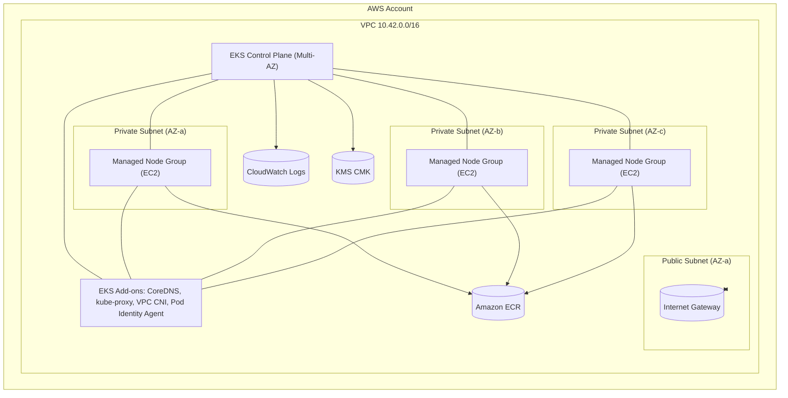

# AWS EKS

The **AWS EKS** module provisions a managed Kubernetes control plane on Amazon Elastic Kubernetes Service (EKS), including supporting network infrastructure and node groups. The module leverages upstream `Terraform AWS Modules` to deliver a complete, modular, and production-ready cluster stack with optional AWS Pod Identity integration.

- [1. Details](#1-details)
  - [1.1. Modules](#11-modules)
  - [1.2. Architecture Diagrams](#12-architecture-diagrams)
    - [1.2.1. AWS](#121-aws)
    - [1.2.2. Terraform](#122-terraform)
- [2. Usage](#2-usage)
  - [2.1. Module](#21-module)
- [3. Requirements](#3-requirements)
- [4. Providers](#4-providers)
- [5. Modules](#5-modules)
- [6. Resources](#6-resources)
- [7. Inputs](#7-inputs)
- [8. Outputs](#8-outputs)

## 1. Details

### 1.1. Modules

> [!NOTE]
> Module Source using [Terraform Registry](https://registry.terraform.io/)

- `terraform-aws-modules/eks/aws`  
  > Creates an Amazon EKS cluster and its associated resources. It manages the control plane, EC2 managed node groups, IAM roles, security groups, and cluster add-ons (CoreDNS, kube-proxy, VPC CNI, and Pod Identity agent).
  >
  > - **Cluster Control Plane**: Deploys an EKS cluster across multiple Availability Zones for high availability and resilience.  
  > - **Node Groups**: Provisions managed EC2-based worker node groups with configurable scaling, instance types, and taints/labels.  
  > - **Networking Integration**: Attaches the EKS cluster to an existing VPC and private subnets for secure traffic isolation.  
  > - **Cluster Add-ons**: Installs and manages EKS-managed add-ons such as CoreDNS, kube-proxy, VPC CNI, and Pod Identity agent.

- `terraform-aws-modules/eks-pod-identity/aws`  
  > Configures AWS Pod Identity associations for Kubernetes service accounts. This enables workloads to assume IAM roles without IRSA.
  >
  > - **IAM Roles**: Creates least-privilege IAM roles scoped for workloads.  
  > - **Pod Identity Associations**: Maps roles to Kubernetes service accounts in specified namespaces.  
  > - **Automation**: Eliminates the need for managing OIDC trust policies manually.

> [!NOTE]
> **Networking Prerequisites:** A VPC with private subnets and appropriate route tables must exist or be created via `terraform-aws-modules/vpc/aws`. Private-only cluster endpoints are the default for security.

### 1.2. Architecture Diagrams

#### 1.2.1. AWS



#### 1.2.2. Terraform

## 2. Usage

### 2.1. Module

- AWS EKS
  > The `main.tf` in the root calls `modules/aws-eks`. Variables in `modules/aws-eks/variables.tf` govern cluster, node groups, add-ons, and Pod Identity associations.

  ```hcl
  provider "aws" {
    region = var.region
  }

  module "aws_eks" {
    source = "./modules/aws-eks"

    cluster_name       = var.cluster_name
    kubernetes_version = var.kubernetes_version

    vpc_id     = var.vpc_id
    subnet_ids = var.private_subnets

    endpoint_public_access  = false

    # Node group configuration
    default_mng_instance_types = ["m6i.large"]
    default_mng_desired_size   = 3
    default_mng_max_size       = 6

    # Optional extra node groups
    extra_managed_node_groups = {
      spot-ci = {
        instance_types = ["m6i.large", "m7i-flex.large"]
        capacity_type  = "SPOT"
        min_size       = 0
        desired_size   = 0
        max_size       = 10
        labels         = { pool = "spot-ci" }
        taints = [{
          key    = "workload"
          value  = "ci"
          effect = "NO_SCHEDULE"
        }]
      }
    }

    # Pod Identity associations
    pod_identity_associations = {
      external-dns = {
        namespace       = "kube-system"
        service_account = "external-dns"
        role_name       = "${var.cluster_name}-external-dns"
        policy_arns = [
          "arn:aws:iam::aws:policy/AmazonRoute53ReadOnlyAccess"
        ]
      }
    }

    tags = var.tags
  }
  ```

<!-- BEGIN_TF_DOCS -->
## 3. Requirements

| Name                                                                         | Version  |
| ---------------------------------------------------------------------------- | -------- |
| <a name="requirement_terraform"></a> [terraform](#requirement\_terraform)    | >= 1.7.0 |
| <a name="requirement_aws"></a> [aws](#requirement\_aws)                      | >= 6.13  |
| <a name="requirement_helm"></a> [helm](#requirement\_helm)                   | >= 3.0   |
| <a name="requirement_http"></a> [http](#requirement\_http)                   | >= 3.4   |
| <a name="requirement_kubernetes"></a> [kubernetes](#requirement\_kubernetes) | >= 2.38  |
| <a name="requirement_local"></a> [local](#requirement\_local)                | >= 2.5   |
| <a name="requirement_tls"></a> [tls](#requirement\_tls)                      | >= 4.0   |

## 4. Providers

| Name                                              | Version |
| ------------------------------------------------- | ------- |
| <a name="provider_aws"></a> [aws](#provider\_aws) | >= 6.13 |

## 5. Modules

| Name                                                                       | Source                                     | Version |
| -------------------------------------------------------------------------- | ------------------------------------------ | ------- |
| <a name="module_eks"></a> [eks](#module\_eks)                              | terraform-aws-modules/eks/aws              | 21.3.1  |
| <a name="module_pod_identity"></a> [pod\_identity](#module\_pod\_identity) | terraform-aws-modules/eks-pod-identity/aws | 2.0.0   |
| <a name="module_vpc"></a> [vpc](#module\_vpc)                              | terraform-aws-modules/vpc/aws              | 6.0.1   |

## 6. Resources

| Name                                                                                                                                  | Type        |
| ------------------------------------------------------------------------------------------------------------------------------------- | ----------- |
| [aws_ami.machine](https://registry.terraform.io/providers/hashicorp/aws/latest/docs/data-sources/ami)                                 | data source |
| [aws_availability_zones.available](https://registry.terraform.io/providers/hashicorp/aws/latest/docs/data-sources/availability_zones) | data source |

## 7. Inputs

| Name                                                                                                                   | Description                                                                                                                                                                                                                                                                                                                                            | Type                                                                                                                                                                                                                                                                                                                                                                                                                                                                                                                                                                      | Default                                                                                                                            | Required |
| ---------------------------------------------------------------------------------------------------------------------- | ------------------------------------------------------------------------------------------------------------------------------------------------------------------------------------------------------------------------------------------------------------------------------------------------------------------------------------------------------ | ------------------------------------------------------------------------------------------------------------------------------------------------------------------------------------------------------------------------------------------------------------------------------------------------------------------------------------------------------------------------------------------------------------------------------------------------------------------------------------------------------------------------------------------------------------------------- | ---------------------------------------------------------------------------------------------------------------------------------- | :------: |
| <a name="input_ami_device_name"></a> [ami\_device\_name](#input\_ami\_device\_name)                                    | The root device type used by the AMI.                                                                                                                                                                                                                                                                                                                  | `string`                                                                                                                                                                                                                                                                                                                                                                                                                                                                                                                                                                  | `"root-device-type"`                                                                                                               |    no    |
| <a name="input_ami_device_types"></a> [ami\_device\_types](#input\_ami\_device\_types)                                 | The root device type, typically EBS-backed for encryption support.                                                                                                                                                                                                                                                                                     | `list(string)`                                                                                                                                                                                                                                                                                                                                                                                                                                                                                                                                                            | <pre>[<br/>  "ebs"<br/>]</pre>                                                                                                     |    no    |
| <a name="input_ami_image_name"></a> [ami\_image\_name](#input\_ami\_image\_name)                                       | The name used to select Amazon Machine Images (AMIs).                                                                                                                                                                                                                                                                                                  | `string`                                                                                                                                                                                                                                                                                                                                                                                                                                                                                                                                                                  | `"name"`                                                                                                                           |    no    |
| <a name="input_ami_image_patterns"></a> [ami\_image\_patterns](#input\_ami\_image\_patterns)                           | The AMI pattern to search for, e.g., Amazon Linux 2023 (AL2023) IDs.                                                                                                                                                                                                                                                                                   | `list(string)`                                                                                                                                                                                                                                                                                                                                                                                                                                                                                                                                                            | <pre>[<br/>  "al2023-ami-2023*-x86_64"<br/>]</pre>                                                                                 |    no    |
| <a name="input_ami_most_recent"></a> [ami\_most\_recent](#input\_ami\_most\_recent)                                    | Use the most recent AMI from the list.                                                                                                                                                                                                                                                                                                                 | `bool`                                                                                                                                                                                                                                                                                                                                                                                                                                                                                                                                                                    | `true`                                                                                                                             |    no    |
| <a name="input_ami_owners"></a> [ami\_owners](#input\_ami\_owners)                                                     | AMI Owners.                                                                                                                                                                                                                                                                                                                                            | `list(string)`                                                                                                                                                                                                                                                                                                                                                                                                                                                                                                                                                            | <pre>[<br/>  "amazon"<br/>]</pre>                                                                                                  |    no    |
| <a name="input_ami_virtualization_name"></a> [ami\_virtualization\_name](#input\_ami\_virtualization\_name)            | The virtualization method used by the AMI.                                                                                                                                                                                                                                                                                                             | `string`                                                                                                                                                                                                                                                                                                                                                                                                                                                                                                                                                                  | `"virtualization-type"`                                                                                                            |    no    |
| <a name="input_ami_virtualization_types"></a> [ami\_virtualization\_types](#input\_ami\_virtualization\_types)         | The virtualization standard, e.g., Hardware Virtual Machine (HVM) used by Amazon EC2 instances.                                                                                                                                                                                                                                                        | `list(string)`                                                                                                                                                                                                                                                                                                                                                                                                                                                                                                                                                            | <pre>[<br/>  "hvm"<br/>]</pre>                                                                                                     |    no    |
| <a name="input_azs_state"></a> [azs\_state](#input\_azs\_state)                                                        | Filter to retrieve availability zones in a specific state.                                                                                                                                                                                                                                                                                             | `string`                                                                                                                                                                                                                                                                                                                                                                                                                                                                                                                                                                  | `"available"`                                                                                                                      |    no    |
| <a name="input_cluster_enabled_log_types"></a> [cluster\_enabled\_log\_types](#input\_cluster\_enabled\_log\_types)    | EKS control plane log types.                                                                                                                                                                                                                                                                                                                           | `list(string)`                                                                                                                                                                                                                                                                                                                                                                                                                                                                                                                                                            | <pre>[<br/>  "api",<br/>  "audit",<br/>  "authenticator",<br/>  "controllerManager",<br/>  "scheduler"<br/>]</pre>                 |    no    |
| <a name="input_create_cluster_kms_key"></a> [create\_cluster\_kms\_key](#input\_create\_cluster\_kms\_key)             | Create a KMS key for secrets encryption.                                                                                                                                                                                                                                                                                                               | `bool`                                                                                                                                                                                                                                                                                                                                                                                                                                                                                                                                                                    | `true`                                                                                                                             |    no    |
| <a name="input_default_mng_capacity_type"></a> [default\_mng\_capacity\_type](#input\_default\_mng\_capacity\_type)    | ON\_DEMAND or SPOT.                                                                                                                                                                                                                                                                                                                                    | `string`                                                                                                                                                                                                                                                                                                                                                                                                                                                                                                                                                                  | `"ON_DEMAND"`                                                                                                                      |    no    |
| <a name="input_default_mng_desired_size"></a> [default\_mng\_desired\_size](#input\_default\_mng\_desired\_size)       | n/a                                                                                                                                                                                                                                                                                                                                                    | `number`                                                                                                                                                                                                                                                                                                                                                                                                                                                                                                                                                                  | `3`                                                                                                                                |    no    |
| <a name="input_default_mng_instance_types"></a> [default\_mng\_instance\_types](#input\_default\_mng\_instance\_types) | n/a                                                                                                                                                                                                                                                                                                                                                    | `list(string)`                                                                                                                                                                                                                                                                                                                                                                                                                                                                                                                                                            | <pre>[<br/>  "m6i.large"<br/>]</pre>                                                                                               |    no    |
| <a name="input_default_mng_max_size"></a> [default\_mng\_max\_size](#input\_default\_mng\_max\_size)                   | n/a                                                                                                                                                                                                                                                                                                                                                    | `number`                                                                                                                                                                                                                                                                                                                                                                                                                                                                                                                                                                  | `6`                                                                                                                                |    no    |
| <a name="input_default_mng_min_size"></a> [default\_mng\_min\_size](#input\_default\_mng\_min\_size)                   | n/a                                                                                                                                                                                                                                                                                                                                                    | `number`                                                                                                                                                                                                                                                                                                                                                                                                                                                                                                                                                                  | `2`                                                                                                                                |    no    |
| <a name="input_endpoint_private_access"></a> [endpoint\_private\_access](#input\_endpoint\_private\_access)            | Expose the cluster endpoint privately.                                                                                                                                                                                                                                                                                                                 | `bool`                                                                                                                                                                                                                                                                                                                                                                                                                                                                                                                                                                    | `true`                                                                                                                             |    no    |
| <a name="input_endpoint_public_access"></a> [endpoint\_public\_access](#input\_endpoint\_public\_access)               | Expose the cluster endpoint publicly.                                                                                                                                                                                                                                                                                                                  | `bool`                                                                                                                                                                                                                                                                                                                                                                                                                                                                                                                                                                    | `false`                                                                                                                            |    no    |
| <a name="input_extra_cluster_addons"></a> [extra\_cluster\_addons](#input\_extra\_cluster\_addons)                     | Extra/override cluster addons map to merge with defaults.                                                                                                                                                                                                                                                                                              | <pre>map(object({<br/>    most_recent              = optional(bool, true)<br/>    resolve_conflicts        = optional(string)<br/>    configuration_values     = optional(string) # JSON<br/>    preserve                 = optional(bool)<br/>    service_account_role_arn = optional(string)<br/>  }))</pre>                                                                                                                                                                                                                                                            | `{}`                                                                                                                               |    no    |
| <a name="input_extra_managed_node_groups"></a> [extra\_managed\_node\_groups](#input\_extra\_managed\_node\_groups)    | Additional managed node groups to merge.                                                                                                                                                                                                                                                                                                               | <pre>map(object({<br/>    ami_type       = optional(string, "AL2_x86_64")<br/>    instance_types = list(string)<br/>    min_size       = number<br/>    desired_size   = number<br/>    max_size       = number<br/>    subnet_ids     = optional(list(string))<br/>    capacity_type  = optional(string, "ON_DEMAND")<br/>    labels         = optional(map(string), {})<br/>    taints = optional(list(object({<br/>      key    = string<br/>      value  = string<br/>      effect = string<br/>    })), [])<br/>    disk_size = optional(number, 40)<br/>  }))</pre> | `{}`                                                                                                                               |    no    |
| <a name="input_fargate_profiles"></a> [fargate\_profiles](#input\_fargate\_profiles)                                   | Optional Fargate profiles.                                                                                                                                                                                                                                                                                                                             | <pre>map(object({<br/>    name                   = string<br/>    selectors              = list(object({ namespace = string, labels = optional(map(string), {}) }))<br/>    subnet_ids             = optional(list(string))<br/>    pod_execution_role_arn = optional(string)<br/>    tags                   = optional(map(string), {})<br/>  }))</pre>                                                                                                                                                                                                                  | `{}`                                                                                                                               |    no    |
| <a name="input_kms_key_administrators"></a> [kms\_key\_administrators](#input\_kms\_key\_administrators)               | Principals with admin access to the created KMS key.                                                                                                                                                                                                                                                                                                   | `list(string)`                                                                                                                                                                                                                                                                                                                                                                                                                                                                                                                                                            | `[]`                                                                                                                               |    no    |
| <a name="input_kubernetes_version"></a> [kubernetes\_version](#input\_kubernetes\_version)                             | Kubernetes control plane version.                                                                                                                                                                                                                                                                                                                      | `string`                                                                                                                                                                                                                                                                                                                                                                                                                                                                                                                                                                  | `"1.33"`                                                                                                                           |    no    |
| <a name="input_name"></a> [name](#input\_name)                                                                         | The EKS cluster name.                                                                                                                                                                                                                                                                                                                                  | `string`                                                                                                                                                                                                                                                                                                                                                                                                                                                                                                                                                                  | `"aws-eks"`                                                                                                                        |    no    |
| <a name="input_node_subnet_ids"></a> [node\_subnet\_ids](#input\_node\_subnet\_ids)                                    | Override subnets for node groups, defaults to `var.subnet_ids`.                                                                                                                                                                                                                                                                                        | `list(string)`                                                                                                                                                                                                                                                                                                                                                                                                                                                                                                                                                            | `null`                                                                                                                             |    no    |
| <a name="input_pod_identity_associations"></a> [pod\_identity\_associations](#input\_pod\_identity\_associations)      | Map of associations. Each entry:<br/>{<br/>  namespace       = "ns"<br/>  service\_account = "sa"<br/>  role\_name       = "role-name"   # IAM role will be created<br/>  policy\_arns     = optional(list(string), [])<br/>  policies\_json   = optional(list(string), []) # JSON policy docs<br/>  tags            = optional(map(string), {})<br/>} | <pre>map(object({<br/>    namespace       = string<br/>    service_account = string<br/>    role_name       = string<br/>    policy_arns     = optional(list(string), [])<br/>    policies_json   = optional(list(string), [])<br/>    tags            = optional(map(string), {})<br/>  }))</pre>                                                                                                                                                                                                                                                                        | `{}`                                                                                                                               |    no    |
| <a name="input_subnet_ids"></a> [subnet\_ids](#input\_subnet\_ids)                                                     | Subnets for EKS control plane & default node groups (usually private).                                                                                                                                                                                                                                                                                 | `list(string)`                                                                                                                                                                                                                                                                                                                                                                                                                                                                                                                                                            | n/a                                                                                                                                |   yes    |
| <a name="input_tags"></a> [tags](#input\_tags)                                                                         | Global resource tags.                                                                                                                                                                                                                                                                                                                                  | `map(string)`                                                                                                                                                                                                                                                                                                                                                                                                                                                                                                                                                             | <pre>{<br/>  "Environment": "Test",<br/>  "Name": "AWS EKS Module",<br/>  "Owner": "DevOps",<br/>  "Terraform": "true"<br/>}</pre> |    no    |
| <a name="input_vpc_id"></a> [vpc\_id](#input\_vpc\_id)                                                                 | VPC ID for the cluster.                                                                                                                                                                                                                                                                                                                                | `string`                                                                                                                                                                                                                                                                                                                                                                                                                                                                                                                                                                  | n/a                                                                                                                                |   yes    |

## 8. Outputs

| Name                                                                                                       | Description                                               |
| ---------------------------------------------------------------------------------------------------------- | --------------------------------------------------------- |
| <a name="output_cluster_ca_certificate"></a> [cluster\_ca\_certificate](#output\_cluster\_ca\_certificate) | Base64 encoded certificate authority data for the cluster |
| <a name="output_cluster_endpoint"></a> [cluster\_endpoint](#output\_cluster\_endpoint)                     | EKS API server endpoint.                                  |
| <a name="output_cluster_name"></a> [cluster\_name](#output\_cluster\_name)                                 | EKS cluster name.                                         |
| <a name="output_cluster_version"></a> [cluster\_version](#output\_cluster\_version)                        | Kubernetes version                                        |
| <a name="output_node_group_role_arns"></a> [node\_group\_role\_arns](#output\_node\_group\_role\_arns)     | Managed node group IAM role ARNs.                         |
| <a name="output_oidc_provider_arn"></a> [oidc\_provider\_arn](#output\_oidc\_provider\_arn)                | OIDC provider ARN.                                        |
<!-- END_TF_DOCS -->